# 🛡️ Incident Response Playbooks

**Enterprise-grade SOC playbooks and workflows for rapid incident response**

[](https://nvlpubs.nist.gov/nistpubs/SpecialPublications/NIST.SP.800-61r2.pdf)
[](#)
[](#)

## 🎯 Overview

This collection provides **battle-tested incident response procedures** designed for Security Operations Centers and cybersecurity professionals. Each playbook follows **NIST SP 800-61 r2** guidelines and provides step-by-step workflows for containing, analyzing, and recovering from security incidents.

### 🚀 **Quick Start**
```bash
git clone https://github.com/Tope-Adekeye/Cyber-Security-Projects.git
cd Cyber-Security-Projects/incident-response-playbooks
```

## 📋 **Available Playbooks**

| Playbook | Description | Use Cases |
|----------|-------------|-----------|
| 🔐 **[Account Compromise](IRP-AccountCompromised/)** | User credential theft & unauthorized access | Stolen passwords, insider threats, privilege escalation |
| ⚠️ **[Critical Incidents](IRP-Critical/)** | High-severity multi-vector attacks | APT campaigns, supply chain attacks, nation-state threats |
| 💾 **[Data Loss](IRP-DataLoss/)** | Data exfiltration & privacy breaches | GDPR incidents, PII exposure, intellectual property theft |
| 🦠 **[Malware](IRP-Malware/)** | Malicious software incidents | Trojans, rootkits, fileless malware, RATs |
| 🎣 **[Phishing](IRP-Phishing/)** | Email-based social engineering | Spear phishing, business email compromise, credential harvesting |
| 🔒 **[Ransomware](IRP-Ransom/)** | Encryption-based extortion | File encryption, double extortion, supply chain ransomware |

## 🏗️ **Framework Structure**

Each playbook follows the **NIST Incident Response Lifecycle**:

```mermaid
graph LR
    A[🛠️ Preparation] --> B[🔍 Detection & Analysis]
    B --> C[🚫 Containment]
    C --> D[🗑️ Eradication]
    D --> E[♻️ Recovery]
    E --> F[📚 Post-Incident]
    F --> A
```



### **1. Preparation** 🛠️
- Asset inventory and baseline establishment
- Communication protocols and escalation procedures
- Tool provisioning and access management
- Training programs and tabletop exercises

### **2. Detection & Analysis** 🔍
- IOC/IOA identification and threat hunting
- Log correlation and pattern analysis
- Root cause analysis and scope determination
- Threat actor attribution and TTP mapping

### **3. Containment, Eradication & Recovery** 🚫🗑️♻️
- Immediate isolation and network segmentation
- Threat removal and system hardening
- Service restoration and validation
- Business continuity maintenance

### **4. Post-Incident Activities** 📚
- Lessons learned documentation
- Detection rule enhancement
- Process improvement initiatives
- Knowledge base updates

## 🔧 **Integration Ready**

### **SIEM Platforms**
- Splunk, Elastic Stack, ArcSight, QRadar
- IBM Security QRadar, Microsoft Sentinel

### **Endpoint Protection**
- CrowdStrike Falcon, Microsoft Defender ATP
- SentinelOne, Carbon Black, Symantec

### **Network Security**
- Palo Alto Networks, Cisco Firepower
- Fortinet FortiGate, Check Point

### **Orchestration & Automation**
- Phantom/SOAR, ServiceNow Security Operations
- IBM Resilient, Demisto (Cortex XSOAR)

## 📊 **Metrics & KPIs**

Track incident response effectiveness:
- **Mean Time to Detection (MTTD)**
- **Mean Time to Containment (MTTC)**
- **Mean Time to Recovery (MTTR)**
- **False Positive Rate**
- **Escalation Accuracy**

## 🎓 **For Training & Certification**

Perfect for:
- **GCIH** (GIAC Certified Incident Handler)
- **GCFA** (GIAC Certified Forensic Analyst)
- **CISSP** Domain 7 (Security Operations)
- **CySA+** (CompTIA Cybersecurity Analyst)

## 🤝 **Contributing**

Improvements and additions welcome:
1. Fork the repository
2. Create your feature branch
3. Add/modify playbooks following the template structure
4. Submit a pull request with detailed descriptions

## 📧 **Contact**

**Tope Adekeye**  
📧 adekeyetopeaiexpert@gmail.com  
🏢 Governance • Risk • Compliance • AI Ethics  
🔗 [LinkedIn](https://linkedin.com/in/tope-adekeye) | [GitHub](https://github.com/Tope-Adekeye)

---
*Part of the [Cyber-Security-Projects](https://github.com/Tope-Adekeye/Cyber-Security-Projects) collection*
